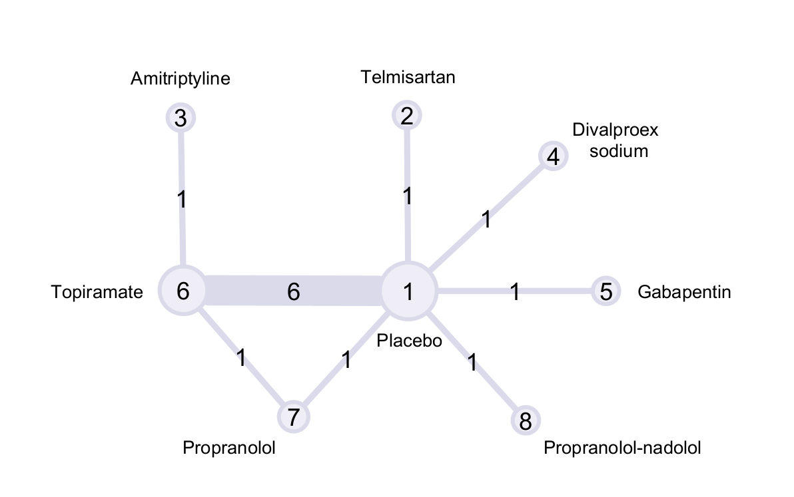
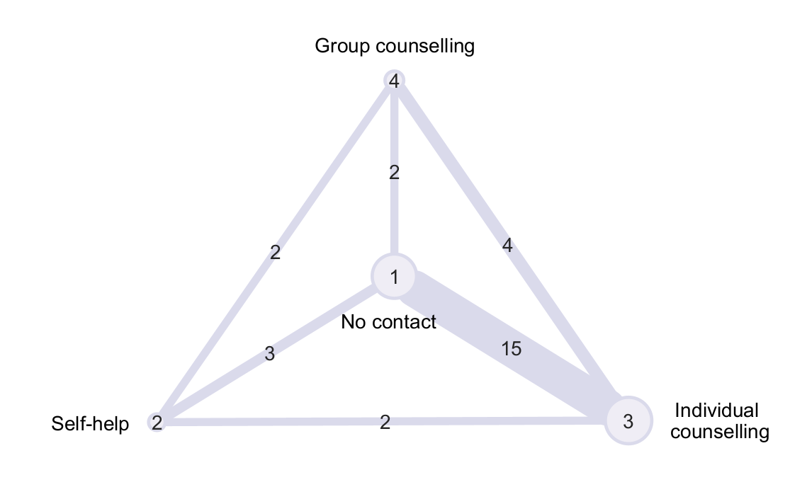

# Introduction

This vignette provides worked examples for the `nmabat` package, recreating exactly the analysis performed in the paper "Interval Bisection Approach to Threshold Analysis for Network Meta-Analysis".

# Comparison with Analytical Approach
To compare the techniques of Phillippo et al. and our proposed method, we replicate an example from their 2019 paper illustrating the varying complexity of possible decision rules. The data forming the basis of the analysis are comprised of 11 studies comparing 8 distinct headache treatments: telmisartan, amitriptyline, divalproex sodium, gabapentin, topiramate, propranolol, propranolol-nadolol, and placebo. The outcome under study was the number of headache days per month associated with each treatment. 

```{r, echo=FALSE, out.width='80%', fig.cap="Headache treatment network."}

```

Phillippo et al. (2019) generated the posterior summaries for the relative treatment contrasts using WinBUGS, and these results are available either from the supplementary data accompanying their paper or from the `nmabat` package.

```{r}
# Read in the posterior summaries
library(nmabat)

# Posterior means of treatment parameters
post.mean.d <- post.summary$statistics[1:7, "Mean"]
post.cov.d <- post.cov[1:7, 1:7]

```

Following the work of Phillippo et al. (2019), we reconstruct the likelihood covariance matrix for these data using the `recon_vcov` function from the `nmathresh` package, using a flat prior with precision 0.0001.

```{r}
# Contrast design matrix 
X <- matrix(ncol = 7,byrow = TRUE,
            # d2 d3 d4 d5 d6 d7 d8
            c(1, 0, 0, 0, 0, 0, 0,
              0, 0, 1, 0, 0, 0, 0,
              0, 0, 0, 1, 0, 0, 0,
              0, 0, 0, 0, 1, 0, 0,
              0, 0, 0, 0, 0, 1, 0,
              0, 0, 0, 0, 0, 0, 1,
              0,-1, 0, 0, 1, 0, 0,
              0, 0, 0, 0,-1, 1, 0))

# Reconstruct using NNLS
lik.cov <- nmathresh::recon_vcov(post.cov.d,  # Posterior covariance matrix
                      prior.prec = .0001,  # Prior precision
                      X = X)               # Contrast design matrix

```

Since the posterior summaries of the relative treatment effects are reported with respect to placebo, we need to create a new vector of relative treatment effects that reports the contrasts represented by edges in the headache treatment network.

```{r}
# Data reformatting for bias threshold analysis
pmean <- c()
trt <- c(2,4,5,6,7,8,6,7)
base <- c(1,1,1,1,1,1,3,6)
for (i in 1:length(trt)) {
  pmean[length(pmean)+1] <- ifelse(base[i] == 1, post.mean.d[trt[i]-1], 
                                   post.mean.d[trt[i]-1] - post.mean.d[base[i]-1])
}

n <- length(pmean)

# Store posterior mean estimates, contrast design matrix, likelihood covariance 
# matrix and posterior covariance matrix in a singular list
data <- list(pmean = pmean, X = X, W = lik.cov, post = post.cov.d)

```


Because this analysis is performed at the level of aggregated contrasts, each estimate of the true underlying treatment contrast is informed by only one observed estimate, and thus a common-effects model is appropriate. Hence we do not estimate $\tau^2$ or attempt to account for between-study heterogeneity in our likelihood covariance matrix.

With our data properly formatted, we can construct a function to implement the decision rule that recommends any treatment that both reduces the expected number of headache days per month by a minimal clinically important difference (mcid) of 0.5 with respect to placebo (treatment 1) and is within 0.5 expected headache days of the most effective treatment. Evaluating this function before bias adjustment, we discover that treatments 3, 6 and 7, or equivalently amitriptyline, topiramate and propranolol, are within the optimal set. Using `bat_1D`, we can then iteratively assess the effect of bias adjustment on the outcomes of our NMA to determine the estimated bias thresholds at which this optimal set changes.

```{r}

head_dec <- function(data, bias = rep(0,n)) {
  # construct Aitken's projection matrix
  H <- solve(t(data$X)%*%(solve(data$W))%*%(data$X))%*%
       t(data$X)%*%(solve(data$W))
  
  # obtain estimated treatment effects under bias adjustment
  treatment_est <- H%*%(data$pmean+bias)
  
  # determine maximally efficacious treatment
  if (all(treatment_est > -0.5)) {
    best <- c(1)
  } else {
    best <- c(which.min(treatment_est) + 1)
  }
  ref <- best[1]
  
  # include all treatments within mcid of ref in the optimal treatment set
  for (i in 1:length(treatment_est)) {
    if (treatment_est[i] <= -0.5 && i != ref - 1 &&
        treatment_est[i] - 0.5 <= treatment_est[ref-1]) {
      best[length(best)+1] <- i + 1
    }
  }
  
  # return optimal treatment set
  return(sort(best))
}

head_dec(data)

# Determine the bias adjustment thresholds for each contrast
head_1D <- bat_1D(data, decision_function = head_dec, indices = 1:n, preset = 0, admin = 30)

```

Using the function `bat_forest`, we can display these estimated thresholds in a forest plot along with the 95\% credible intervals reported by Phillippo et al. (2019) for the posterior means.

```{r, fig.width = 12, fig.height = 3.5, out.width='100%', dpi=300}
# include CrI estimates and appropriate row labels
CrI.lo <- c(-2.32,-0.99,-1.6,-1.51,-2.20,-1.64,-1.13,-1.11)
CrI.hi <- c(1.27,1.23,1.58,-0.58,-0.2,0.45,1.32,0.82)

rlab <- c("2 vs. 1", "4 vs. 1", "5 vs. 1", "6 vs. 1", "7 vs. 1", "8 vs. 1", "6 vs. 3", "7 vs. 6")

bat_forest(head_1D, pmean, CrI.lo, CrI.hi, rlab, xlim = c(-3,2), xlab = "Change in Headache Days per Month", label.title = "Contrast", CI.title = "95% CrI", refline = 0, digits = 2, calcdim = FALSE)

```

When the endpoint of the credible interval for a given data point lies beyond the boundary of its bias invariant interval, the portion of the invariant interval corresponding to the associated direction of bias adjustment is plotted in pink, rather than blue. As evidenced by the many pink subintervals illustrated above, the 95\% credible intervals of each treatment contrast exceed their associated bias invariant intervals in at least one direction, with both of the 6 vs. 3 and 7 vs. 6 contrasts having bias invariant intervals that are proper subsets of their credible intervals. This indicates that the recommendation of amitriptyline, topiramate and propranolol as optimal treatments might not be robust to the inherent uncertainty or potential bias in each of our contrast estimates.


# Application to Cost-Effectiveness Analysis
To illustrate the broader applications of our method to economic health technology assessments, we obtain bias thresholds for the following cost-effectiveness analysis on smoking cessation interventions extended from the book "Network Meta-Analysis for Decision Making" by Dias et al. (2018). The data underpinning our analysis are comprised of 24 studies, 2 three-arm and 22 two-arm trials, on four treatments: no contact (which is selected as the reference treatment), self-help, individual counselling and group counselling. Each study records the number of successful smoking cessations at 6-12 months out of the total number of individuals randomized to each trial arm.

```{r, echo=FALSE, out.width='80%', fig.cap="Smoking cessation treatment network."}

```

For ease and reproducibility, the individual study data are available in the 'data' folder of the `nmabat` package under the name `smk.data.Rda`. Once these data are read in, we can employ the `pairwise` function from the `meta` package to reformat our data.

```{r}
# Read in the individual study data
library(nmabat)

# Prepare data for input to netmeta_slim
pw <- meta::pairwise(treat = treatment, event = responders, n = sampleSize,
                studlab = study, data = smk.count, sm = "OR")
n <- length(pw$TE)
net_slim <- netmeta_slim(pw)
```

With our data properly formatted, we can construct a function to implement the decision rule that recommends the treatment that is most cost-effective in regards to the net benefit function
$$ NB(k,w,\beta) = \zeta(\beta)_k \cdot g \cdot w - c_k, $$
with $w$ representing the value that a decision maker is willing to spend to achieve a one unit gain in quality adjusted life years (QALYs), and $g$ representing the number of QALYs gained as a result of smoking cessation. This function depends on the absolute probabilities of smoking cessation, $\zeta(\beta)_k$ for each treatment $k$, defined as
$$ \text{logit}(\zeta(\beta)_k) = -2.589 + \tilde{\theta}(\beta)_{1k} $$
where $-2.589$ is the predictive mean for the log odds of smoking cessation under no contact as given by Dias et al. (2018) and $\tilde{\theta}(\beta)_{1k}$ is the estimated log odds ratio of smoking cessation for treatment $k$ as compared to no contact that we obtain from our NMA following bias adjustment by $\beta$. To account for possible heterogeneity in the observed data, the estimates for the log odds ratios of each treatment are obtained from a random-effects NMA, which we use `netmeta_slim` to implement. 

Additionally, the net benefit of each treatment cannot be calculated without $c_k$, the expected cost of each treatment $k$, which are reported by Dias et al. (2018) in British pounds as &#8356;0 for no contact, &#8356;200 for self-help, &#8356;6000 for individual counselling and &#8356;600 for group therapy. Assuming that smoking cessation results in a gain of 15 QALYs and employing the standard willingness to pay value of &#8356;20,000 per QALY gained, we can then substitute $g = 15$, $w = 20000$, $\zeta(\beta)_k$ and $c_k$ to obtain our estimates of net benefit for each treatment $k$, the maximal of which corresponds to the most cost-effective treatment. Before bias adjustment, group counselling is identified by this function as most cost-effective.

```{r, warning = FALSE}
# Define the CEA decision function
CEA_decision <- function(data, bias = rep(0,n)) {
  
  # adjust study-level contrasts for bias
  data$TE <- data$TE + bias
  
  # conduct network meta-analysis
  net <- netmeta_slim(data)
  
  # log odds ratios of response (RE model)
  lor <- net$TE.random[,1]
  
  # absolute probabilities of smoking cessation
  T_k <- 1/(1+exp(2.589 - lor))
  
  # costs of treatment in British pounds 
  C_k <- c(0,200,6000,600)
  
  # Net Benefit
  will <- 20000
  NB <- T_k*15*will-C_k
  best <- which.max(NB)
 
  return(best)
}

# One-dimensional threshold analysis for 2-arm studies
CEA_2arm_1D <- bat_1D(data = pw, decision_function = CEA_decision, indices = 7:n, preset = 0, admin = 10, future_plan = future::plan('multisession'))

# Two-dimensional threshold analysis for 2-arm studies
CEA_2arm_2D.1 <- bat_2D(data = pw, decision_function = CEA_decision, ind1 = c(10), ind2 = c(26), preset = 0, admin = 10, future_plan = future::plan('multisession'), plot = FALSE)

CEA_2arm_2D.2 <- bat_2D(data = pw, decision_function = CEA_decision, ind1 = c(23), ind2 = c(25), preset = 0, admin = 10, future_plan = future::plan('multisession'), plot = FALSE)

```

Using our functions for one-dimensional and two-dimensional bias threshold identification, we obtain bias invariant intervals for each of the 22 2-arm trials, along with select bias invariant regions for simultaneous adjustment, both of which are depicted below. The 95\% confidence intervals for each estimate were constructed by application of the Vysochanskij–Petunin inequality using their estimated standard errors obtained from the `netmeta_slim` function. Due to the logit link between the relative treatment effects from our NMA and the absolute treatment effects on which the net benefit function is dependent, our decision function is nonlinear in the estimates of our NMA, which is visually evident in the plots depicting two-dimensional bias adjustment. 

```{r, fig.width = 14.4, fig.height = 7.7, out.width='100%', dpi=300}
# Format labels for treatment contrasts
lkup <- c(A = 1, B = 2, C = 3, D = 4)
pw$treat2_num <- lkup[pw$treat2]
pw$treat1_num <- lkup[pw$treat1]
labs <- paste0(pw$treat2_num, " vs. ", pw$treat1_num, " (", pw$studlab,")")

# Forest plot for bias adjustment in 2-arm studies
bat_forest(CEA_2arm_1D, net_slim$TE[7:n], net_slim$TE[7:n]-3*net_slim$seTE[7:n], net_slim$TE[7:n]+3*net_slim$seTE[7:n], labs[7:n], xlim = c(-10,10), y.title = "LOR", xlab = "Log Odds Ratio", label.title = "Contrast (Study)", calcdim = FALSE)

# 2D plot for simultaneous bias adjustment
print_bat_2D(CEA_2arm_2D.1, labX = "Bias (Study 06)", labY = "Bias (Study 22)")
print_bat_2D(CEA_2arm_2D.2, labX = "Bias (Study 19)", labY = "Bias (Study 21)")

```


While bias thresholds for adjustment in singular trial contrasts cannot be obtained for a multi-arm study without disrupting the consistency of the network, since adjustment in only one contrast of a multi-arm trial would result in inconsistency between the direct and indirect evidence reported by the trial, thresholds for bias adjustment at the arm level can be obtained even for binomial response data by projection of adjustment at the contrast level within 3-arm studies. To summarize, since each individual treatment arm contributes to the direct evidence for exactly two contrasts comparing it to the remaining treatments, a simultaneous adjustment of both such contrasts in the direction of the selected treatment (negative when the selected treatment is the comparator, positive when it is the alternate treatment) would be equivalent to directly adjusting the log odds of that treatment and would not disrupt consistency of the network. Additional mathematical details pertaining to this projected adjustment can be found in "Interval Bisection Approach to Threshold Analysis for Network Meta-Analysis".


```{r, warning = FALSE}
# Define function for projecting bias to arm-level in multi-arm studies
n <- 6
proj_decision <- function(data, bias = rep(0,n)) {
  # convert bias vector to scalar
  scl_bias <- sum(bias)
  
  # adjust associated study-level contrasts for projected bias
  ind <- which(bias != 0)
  mult_trt <- c("A","C","D","B","C","D")
  study <- c("01","01","01","02","02","02")
  
  if (scl_bias != 0) {
    for (i in 1:nrow(data)) {
      if (data$studlab[i] == study[ind] && data$treat1[i] == mult_trt[ind]) {
        data$TE[i] <- data$TE[i] - scl_bias
      }
      if (data$studlab[i] == study[ind] && data$treat2[i] == mult_trt[ind]) {
        data$TE[i] <- data$TE[i] + scl_bias
      }
    }
  }
  
  # conduct network meta-analysis
  net <- netmeta_slim(data)
  
  # log odds ratios of response (RE model)
  lor <- net$TE.random[,1]
  
  # absolute probs of smoking cessation
  T_k <- 1/(1+exp(2.589 - lor))
  
  # costs of treatment in British pounds 
  C_k <- c(0,200,6000,600)
  
  # Net Benefit
  will <- 20000
  NB <- T_k*15*will-C_k
  best <- which.max(NB)
 
  return(best)
}

# One-dimensional threshold analysis for 3-arm studies
CEA_3arm_1D <- bat_1D(data = pw, decision_function = proj_decision, indices = 1:6, preset = 0, future_plan = plan(multisession))

```

Implementing a decision function to perform this projected arm-level bias adjustment for the smoking cessation data, we obtain the thresholds for multi-arm studies 01 and 02 as reported below. The confidence intervals for each log odds are constructed using the approximate distribution of log odds as outlined by B&#233;liveau and Gustafson (2021).

```{r, fig.width= 14.27, fig.height = 3.05, out.width='100%', dpi=300}
# 3-arm studies only (arm level bias projected to study level)
labs2 <- c("1 (01)", "3 (01)", "4 (01)", "2 (02)", "3 (02)", "4 (02)")

# format the log odds column within each arm 
pw[1:6,c(2,3,6,7,8,9)]
logodds <- function(p) {
  return (log(p/(1-p)))
}
invlogodds <- function(p) {
  return (1/(1+exp(-p)))
}
LO <- c(logodds(pw$event1[1]/pw$n1[1]), logodds(pw$event2[1]/pw$n2[1]), logodds(pw$event2[2]/pw$n2[2]), logodds(pw$event1[4]/pw$n1[4]), logodds(pw$event2[4]/pw$n2[4]), logodds(pw$event2[5]/pw$n2[5]))

# estimate variance of the log odds in each arm
nVec <- c(pw$n1[1],pw$n2[1],pw$n1[2],pw$n1[4],pw$n2[4],pw$n2[5])
var <- mapply(function(i) (nVec[i]*invlogodds(LO[i])*(1-invlogodds(LO[i])))**(-1),1:6)

bat_forest(CEA_3arm_1D, LO, LO - 1.96*sqrt(var), LO + 1.96*sqrt(var), labs2, xlim = c(-6,2), y.title = "LO", xlab = "Log Odds", label.title = "Treatment (Study)", calcdim = FALSE)

```

We observe that the 95\% confidence intervals are contained well within the bias invariant intervals for each adjusted arm, indicating that the recommendation of group counselling as the most cost-effective treatment is robust to potential bias in any one of the treatment arms of these multi-arm trials. 

